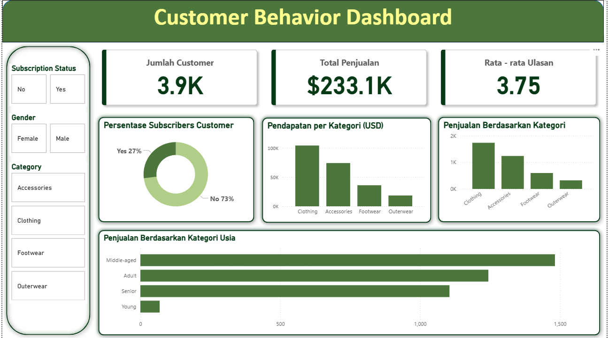

# 📊 Customer Behavior Analysis

## 📄 Overview
Proyek ini menganalisis perilaku belanja pelanggan berdasarkan dataset transaksi retail. Tujuan utamanya adalah untuk memahami pola pembelian, segmentasi pelanggan, dan faktor-faktor yang memengaruhi keputusan belanja. Proses analisis mencakup:
- Data collecting dari file CSV
- Exploratory Data Analysis (EDA) dan Cleansing data menggunakan Python
- Analisis database dan query bisnis menggunakan PostgreSQL
- Visualisasi interaktif melalui dashboard Power BI untuk mendukung pengambilan keputusan
Proyek ini dibuat sebagai simulasi proses data lifecycle end-to-end yang sering dilakukan dalam industri e-commerce dan retail—mulai dari pengolahan data mentah hingga penyajian hasil analisis dalam bentuk visual yang mudah dipahami oleh stakeholder bisnis.

## 📂 Dataset
Dataset yang digunakan dalam proyek ini adalah Customer Shopping Trends yang disediakan secara publik oleh Kaggle. Dataset ini berisi informasi tentang perilaku belanja pelanggan dan mencakup 3.900 records dengan 19 fitur yang relevan untuk analisis tren pembelian, segmentasi pelanggan, dan strategi pemasaran.
- Sumber Dataset: 🔗 [Customer Shopping Trends Dataset (Kaggle)](https://www.kaggle.com/datasets/iamsouravbanerjee/customer-shopping-trends-dataset) 
- Jumlah Records: 3,900
- Jumlah Fitur: 19
- Tipe Data: Numerik, Kategorikal, dan Teks

### 🧾 Deskripsi Fitur

| Fitur                     | Deskripsi                                                                |
|---------------------------|--------------------------------------------------------------------------------------|
| **Customer ID**           | Nomor identitas unik untuk membedakan setiap pelanggan                               |
| **Age**                   | Usia pelanggan dalam tahun                                                           |
| **Gender**                | Jenis kelamin pelanggan *(Laki-laki atau Perempuan)*                                 |
| **Item Purchased**        | Nama barang yang dibeli pelanggan                                                    |
| **Category**              | Kategori dari barang yang dibeli *(contoh: Clothing, Accessories, Footwear)*         |
| **Purchase Amount (USD)** | Total uang yang dikeluarkan pelanggan untuk pembelian tersebut (dalam Dollar USD)    |
| **Location**              | Tempat atau kota di mana transaksi pembelian terjadi                                 |
| **Size**                  | Ukuran barang yang dibeli *(contoh: S, M, L, XL)*                                    |
| **Color**                 | Warna barang yang dibeli                                                             |
| **Season**                | Musim saat transaksi dilakukan *(contoh: Summer, Winter, Autumn, Spring)*            |
| **Review Rating**         | Penilaian atau rating dari pelanggan setelah membeli barang (skala 1–5)              |
| **Subscription Status**   | Apakah pelanggan terdaftar dalam langganan toko *(Ya atau Tidak)*                    |
| **Shipping Type**         | Jenis pengiriman yang dipilih pelanggan *(contoh: Standard, Express)*                |
| **Discount Applied**      | Menunjukkan apakah pembelian mendapatkan potongan harga *(Ya atau Tidak)*            |
| **Promo Code Used**       | Menunjukkan apakah pelanggan menggunakan kode promo *(Ya atau Tidak)*                |
| **Previous Purchases**    | Jumlah pembelian yang telah dilakukan pelanggan sebelum transaksi ini                |
| **Payment Method**        | Cara pelanggan membayar, seperti kartu kredit, debit, e-wallet, dll                  |
| **Frequency of Purchases**| Seberapa sering pelanggan berbelanja *(contoh: Mingguan, Dua Minggu Sekali, Bulanan)*|

## 🛠️ Tools & Technologies
Proyek ini menggunakan berbagai tools dan teknologi yang umum digunakan dalam analisis data end-to-end, mulai dari pengolahan data mentah hingga visualisasi hasil akhir.
- Python : Digunakan untuk Exploratory Data Analysis (EDA) dan pembersihan data.
- PostgreSQL : Digunakan sebagai database untuk menyimpan dan mengeksekusi query analitis menggunakan bahasa SQL.
- Power BI : Digunakan untuk membuat dashboard visual interaktif yang menyajikan hasil analisis secara visual dan mudah dipahami oleh stakeholder.
- VS Code / Jupyter Notebook : Sebagai IDE utama untuk penulisan kode Python dan SQL.

## 🧪 Project Steps  
Proyek ini dilakukan melalui beberapa tahapan analisis data end-to-end yang umum di dunia data analyst, yaitu:

1. **📥 Data Collecting**  
   - Mengambil dataset *Customer Shopping Trends* dari Kaggle  
   - Memuat data ke dalam Jupyter Notebook untuk proses awal analisis

2. **🔍 Exploratory Data Analysis (EDA)**  
   - Menganalisis struktur data, tipe data, dan statistik deskriptif  
   - Membuat visualisasi awal seperti boxplot dan histogram
   - Menemukan insight awal terkait pola belanja pelanggan
   - Data Cleaning seperti Menangani missing value dan duplikasi
   - Feature Engineering
   - Database Integration

3. **📊 Running SQL Queries with PostgreSQL**  
   - Menyimpan data ke dalam database PostgreSQL  
   - Menjalankan query analitik untuk menjawab pertanyaan bisnis, seperti:
        - Berapa total pendapatan yang dihasilkan oleh pelanggan laki-laki dan pelanggan perempuan?
        - Pelanggan mana yang menggunakan diskon tetapi tetap membelanjakan lebih dari rata-rata jumlah pembelian?
        - Apa saja 5 produk teratas dengan rating ulasan rata-rata tertinggi?
        - Bandingkan rata-rata jumlah pembelian antara pengiriman Standard dan Express.
        - Apakah pelanggan yang berlangganan (subscribed) membelanjakan lebih banyak? Bandingkan rata-rata pengeluaran dan total pendapatan antara pelanggan yang berlangganan dan yang tidak.
        - Manakah 5 produk yang memiliki persentase pembelian dengan diskon tertinggi?
        - Segmentasikan pelanggan menjadi Baru (New), Kembali (Returning), dan Loyal berdasarkan total jumlah pembelian sebelumnya, lalu tampilkan jumlah masing-masing segmen.
        - Apa saja 3 produk yang paling banyak dibeli dalam setiap kategori?
        - Apakah pelanggan yang merupakan pembeli ulang (lebih dari 3 kali pembelian sebelumnya) juga cenderung berlangganan?
        - Berapa kontribusi pendapatan dari setiap kelompok umur?

4. **📈 Dashboard Creation Using Power BI**  
   - Mendesain dashboard interaktif untuk memvisualisasikan pola dan tren belanja pelanggan  
   - Menyajikan KPI seperti total pembelian, rata-rata nilai pembelian per kategori, dan distribusi pelanggan

5. **📑 Documentation & Results Reporting**  
   - Menyusun hasil analisis dan insight dalam format visual dan teks  
   - Membuat README untuk menjelaskan keseluruhan proses proyek

## 📊 Dashboard Preview
Dashboard interaktif ini dibuat menggunakan Power BI untuk memvisualisasikan pola dan perilaku belanja pelanggan secara lebih mudah dipahami oleh stakeholder. Dashboard ini terdiri dari beberapa komponen analisis utama, di antaranya:

**✅ KPI Utama**
- Jumlah Customer: 3.9K pelanggan
- Total Pendapatan: $233.081K
- Rata-rata Rating Ulasan: 3.75

**✅ Visualisasi Utama**
- Persentase Pelanggan Berlangganan (Subscription Status)
- Total Pendapatan (USD)
- Jumlah Penjualan Berdasarkan Kategori Produk
- Penjualan Berdasarkan Kategori Usia Pelanggan

**✅ Interactive Filters**
Pengguna dapat melakukan filter berdasarkan:
- Status Langganan (Yes/No)
- Gender
- Kategori Produk

**🖼️ Dashboard Screenshot**

## 🔍 Key Insights

**1. Mayoritas pelanggan bukan subscriber**
- Hanya 27% pelanggan yang berlangganan (subscription status = Yes), sedangkan 73% tidak.
- Pelanggan yang berlangganan cenderung memiliki jumlah pembelian lebih tinggi dibanding non-subscriber.
- Jenis kelamin Pria cenderung berlangganan, sedangkan wanita tidak ada yang berlangganan

**2. Kategori produk dengan pendapatan tertinggi adalah Clothing**
- Kategori Clothing menghasilkan pendapatan lebih dari $100K, diikuti oleh Accessories dan Footwear.
- Outerwear menjadi kategori dengan pendapatan terendah.

**3. Segmentasi usia menunjukkan pelanggan usia kelompok dewasa (Adult & Middle-aged) paling dominan dalam pembelian**
- Kelompok Middle-aged memiliki volume penjualan terbesar.
- Pelanggan usia Young menunjukkan pembelian paling rendah.

**4. Rata-rata review rating cukup positif: 3.75/5**
- Rating menunjukkan tingkat kepuasan yang cukup baik, namun masih ada ruang untuk peningkatan kualitas produk/layanan.

## Kesimpulan
Berdasarkan insight di atas, strategi bisnis yang dapat dipertimbangkan antara lain:
- Meningkatkan program subscription, karena pelanggan berlangganan cenderung lebih loyal dan belanja lebih banyak.
- Fokus pada kategori produk Clothing & Accessories, karena menjadi penyumbang pendapatan terbesar.
- Mengoptimalkan promo & diskon pada kategori produk dengan penjualan rendah untuk mendorong lebih banyak pembelian.

